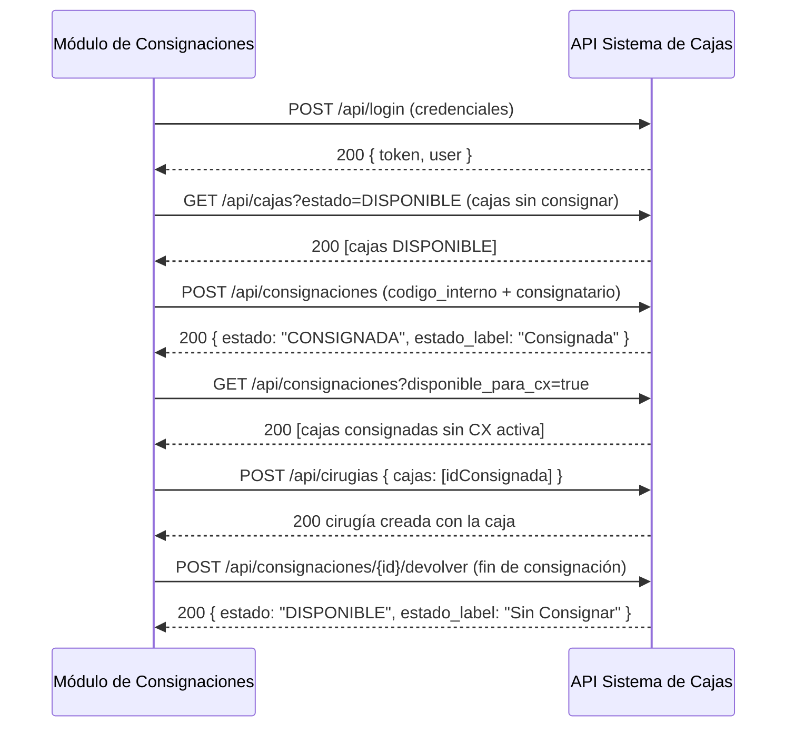

# 📦 API Sistema de Cajas — Integración Módulo de Consignaciones

Documentación técnica de conexión entre el **Módulo de Consignaciones** y el **Sistema de Cajas** (Laravel 12 + Sanctum).

---

## 1. Datos de conexión

| Parámetro | Valor |
|---|---|
| **URL base** | `http://localhost:8000/api` |
| **Formato** | `application/json` (request y response) |
| **Autenticación** | Token Bearer (Laravel Sanctum) |

### ⚠️ Requisito obligatorio

Toda petición **debe** enviar el header:

```
Accept: application/json
```

Si no se envía, el servidor **redirige a la página HTML de login** en lugar de devolver JSON (comportamiento de Laravel).

---

## 2. Autenticación

El módulo inicia sesión **una vez** con un usuario existente del sistema y recibe un token que debe reutilizar en todas las peticiones.

### Credenciales recomendadas

| Usuario | Contraseña | Rol | Permisos |
|---|---|---|---|
| `deposito@test.com` | `password` | deposito | consignaciones (lectura/escritura) + cajas (lectura/escritura) ✅ **Recomendado** |
| `admin@test.com` | `password` | admin | Acceso total a la API |

### 2.1 Iniciar sesión → obtener token

**`POST /api/login`** (público, sin token)

```json
{
  "email": "deposito@test.com",
  "password": "password",
  "device_name": "modulo-consignaciones"
}
```

**Respuesta 200 OK:**

```json
{
  "token": "1|aBcDeFgHiJkLmNoPqRsTuVwXyZ0123456789abcdef...",
  "token_type": "Bearer",
  "user": {
    "id": 2,
    "name": "Usuario Deposito",
    "email": "deposito@test.com",
    "role": "deposito"
  }
}
```

> 💡 Guarde el `token` en la configuración del módulo. Los tokens de Sanctum no expiran salvo que se revoquen.

### 2.2 Enviar token en cada petición

```
Authorization: Bearer <token>
Accept: application/json
```

### 2.3 Otros endpoints de sesión (opcionales)

| Método | Ruta | Descripción |
|---|---|---|
| `GET` | `/api/me` | Datos del usuario autenticado |
| `POST` | `/api/logout` | Cierra sesión y revoca el token actual |
| `GET` | `/api/tokens` | Lista los tokens activos del usuario |
| `DELETE` | `/api/tokens/{tokenId}` | Revoca un token específico |

---

## 3. Endpoints del módulo

> Todos los endpoints requieren el header `Authorization: Bearer <token>`.
> Las listas paginan por defecto (15 por página); use `?per_page=` para cambiar.

### 3.1 Cajas

#### Listar cajas

**`GET /api/cajas`**

Parámetros de filtro (todos opcionales):

| Parámetro | Tipo | Descripción |
|---|---|---|
| `estado` | string | Filtra por estado exacto (`DISPONIBLE`, `CONSIGNADA`, `EN ESTERILIZADORA`, `EN CX`, `PENDIENTE`, `EN REPARACION`, `BAJA`, etc.) |
| `codigo_interno` | string | Búsqueda parcial por código interno |
| `nombre` | string | Búsqueda parcial por nombre |
| `grupo_id` | integer | Filtra cajas que pertenecen a un grupo |
| `per_page` | integer | Elementos por página (por defecto 15) |

**Respuesta 200 (paginated):**

```json
{
  "data": [
    {
      "id": 513,
      "nombre": "30719303028_006_00001_00000001",
      "codigo_interno": "CAJA-513",
      "estado": "DISPONIBLE",
      "estado_label": "Sin Consignar",
      "consignatario_nombre": null,
      "fecha_consignacion": null,
      "pdf_path": null,
      "imagen_salida_path": null,
      "created_at": "2026-08-14T10:00:00.000000Z",
      "updated_at": "2026-08-14T10:00:00.000000Z",
      "cirugias": [],
      "grupos": []
    }
  ],
  "links": { "...": "..." },
  "meta": { "current_page": 1, "last_page": 1, "total": 1 }
}
```

#### Ver detalle de una caja

**`GET /api/cajas/{cajaId}`**

Carga las relaciones: `cirugias`, `eventos`, `consumos`, `imagenes`, `grupos`.

#### Crear caja

**`POST /api/cajas`**

```json
{
  "nombre": "Nombre de la caja",
  "codigo_interno": "CAJA-999",
  "estado": "DISPONIBLE",
  "pdf_path": null,
  "imagen_salida_path": null
}
```

| Campo | Obligatorio | Notas |
|---|---|---|
| `nombre` | ✅ | string máx. 255 |
| `codigo_interno` | ✅ | string máx. 255, **único** |
| `estado` | ❌ | enum: `DISPONIBLE`, `EN ESTERILIZADORA`, `EN CX`, `EN TRANSITO`, `PENDIENTE`, `ACONDICIONAMIENTO`, `EN REPARACION`, `BAJA`, `CONSIGNADA` (por defecto `DISPONIBLE`) |
| `pdf_path` | ❌ | string |
| `imagen_salida_path` | ❌ | string |

#### Actualizar caja

**`PUT /api/cajas/{cajaId}`** o **`PATCH /api/cajas/{cajaId}`**

Mismos campos que crear (todos opcionales al actualizar).

#### Eliminar caja

**`DELETE /api/cajas/{cajaId}`**

**Respuesta:** `{ "message": "Caja eliminada correctamente." }`

#### Cambiar estado de una caja

**`PATCH /api/cajas/{cajaId}/estado`**

```json
{
  "estado": "EN REPARACION",
  "observaciones": "Motivo del cambio"
}
```

> ⚠️ Este endpoint **no valida transiciones** (solo registra el evento). Para el flujo de consignación use los endpoints dedicados de la sección 3.2, que sí validan reglas de negocio.

---

### 3.2 ⭐ Consignaciones (núcleo del módulo)

#### Listar cajas consignadas

**`GET /api/consignaciones`**

Solo devuelve cajas en estado **`CONSIGNADA`**, ordenadas por fecha de consignación (desc).

Parámetros de filtro (todos opcionales):

| Parámetro | Tipo | Descripción |
|---|---|---|
| `consignatario_nombre` | string | Búsqueda parcial por consignatario |
| `codigo_interno` | string | Búsqueda parcial por código interno |
| `disponible_para_cx` | boolean | `true` → **solo cajas sin cirugía activa** (excluye las que tienen una CX en `PENDIENTE` o `EN_CURSO`) |
| `per_page` | integer | Elementos por página |

**Respuesta 200:**

```json
{
  "data": [
    {
      "id": 513,
      "nombre": "30719303028_006_00001_00000001",
      "codigo_interno": "CAJA-513",
      "estado": "CONSIGNADA",
      "estado_label": "Consignada",
      "consignatario_nombre": "Cliente Ejemplo S.A.",
      "fecha_consignacion": "2026-08-14T15:30:00.000000Z",
      "pdf_path": null,
      "imagen_salida_path": null,
      "created_at": "2026-08-14T10:00:00.000000Z",
      "updated_at": "2026-08-14T15:30:00.000000Z",
      "cirugias": [],
      "grupos": []
    }
  ],
  "meta": { "current_page": 1, "last_page": 1, "total": 1 }
}
```

#### Ver detalle de una caja consignada

**`GET /api/consignaciones/{cajaId}`**

Devuelve la caja con `cirugias`, `eventos`, `consumos`, `imagenes`, `grupos`.

**Error 422** si la caja no está en estado `CONSIGNADA`:

```json
{
  "message": "La caja no se encuentra en estado CONSIGNADA.",
  "errors": { "caja": ["La caja no se encuentra en estado CONSIGNADA."] }
}
```

#### ⭐ Consignar una caja (marcar como CONSIGNADA)

**`POST /api/consignaciones`**

Se identifica la caja por **`caja_id`** **o** por **`codigo_interno`** (solo uno de los dos).

```json
{
  "codigo_interno": "CAJA-513",
  "consignatario_nombre": "Cliente Ejemplo S.A.",
  "fecha_consignacion": "2026-08-14T15:30:00",
  "observaciones": "Consignada por el módulo"
}
```

| Campo | Obligatorio | Notas |
|---|---|---|
| `caja_id` | ⚠️ uno de los dos | integer, debe existir |
| `codigo_interno` | ⚠️ uno de los dos | string, debe existir |
| `consignatario_nombre` | ✅ | string máx. 255 (nombre del cliente que consigna) |
| `fecha_consignacion` | ❌ | fecha (por defecto: ahora) |
| `observaciones` | ❌ | string |

**Respuesta 200:** la caja en estado `CONSIGNADA` (ver esquema de respuesta en listar consignadas).

**Errores 422 posibles:**

```json
// La caja ya estaba consignada
{ "message": "La caja ya se encuentra en estado CONSIGNADA.", "errors": { "caja": ["..."] } }

// La caja no está DISPONIBLE (ej. está en EN CX)
{ "message": "No se puede consignar una caja en estado EN CX. Solo se consignan cajas DISPONIBLES.", "errors": { "caja": ["..."] } }

// Falta el consignatario
{ "message": "El consignatario (cliente) es obligatorio.", "errors": { "consignatario_nombre": ["..."] } }
```

#### Devolver una caja consignada (→ Sin Consignar)

**`POST /api/consignaciones/{cajaId}/devolver`**

```json
{
  "observaciones": "El cliente devolvió la caja"
}
```

- Cambia la caja a estado **`DISPONIBLE`** (mostrado como **"Sin Consignar"**).
- Limpia `consignatario_nombre` y `fecha_consignacion`.
- **Error 422** si la caja no está consignada.

#### Estadísticas de consignaciones

**`GET /api/consignaciones/stats`**

**Respuesta 200:**

```json
{
  "total_consignadas": 3,
  "por_consignatario": [
    { "consignatario_nombre": "Cliente Ejemplo S.A.", "total": 2 },
    { "consignatario_nombre": "Hospital Centro", "total": 1 }
  ]
}
```

---

### 3.3 Cirugías (CX)

#### Listar cirugías

**`GET /api/cirugias`**

#### Ver detalle

**`GET /api/cirugias/{cirugiaId}`**

#### Crear cirugía (y opcionalmente asociar cajas)

**`POST /api/cirugias`**

```json
{
  "plc_cod": "PLC-00123",
  "bioimplant_id": "BIO-45",
  "paciente": "Nombre del paciente",
  "medico": "Dr. Apellido",
  "fecha_cx": "2026-08-20",
  "start_time": "2026-08-20T08:00:00",
  "end_time": null,
  "tecnico_id": null,
  "tecnico_nombre": null,
  "observaciones": null,
  "status": "PENDIENTE",
  "cajas": [513]
}
```

| Campo | Obligatorio | Notas |
|---|---|---|
| `paciente` | ✅ | string |
| `medico` | ✅ | string |
| `fecha_cx` | ✅ | fecha |
| `plc_cod` / `bioimplant_id` | ❌ | string |
| `start_time` / `end_time` | ❌ | datetime |
| `tecnico_id` | ❌ | debe existir en `users` |
| `tecnico_nombre` | ❌ | string |
| `status` | ❌ | enum: `PENDIENTE`, `EN_CURSO`, `COMPLETADA`, `CANCELADA`, `POSTPUESTA` |
| `cajas` | ❌ | array de ids de caja |

**⚠️ Regla de negocio:** al asociar cajas (`cajas`), **todas deben estar en estado `CONSIGNADA`**. Si alguna no lo está → **error 422**:

```json
{
  "message": "Solo las cajas CONSIGNADAS pueden asignarse a una cirugía. No consignadas: CAJA-515 (Sin Consignar)",
  "errors": { "cajas": ["Solo las cajas CONSIGNADAS pueden asignarse a una cirugía. No consignadas: CAJA-515 (Sin Consignar)"] }
}
```

#### Actualizar / Eliminar

**`PUT|PATCH /api/cirugias/{cirugiaId}`** · **`DELETE /api/cirugias/{cirugiaId}`**

#### Asociar cajas a una cirugía

**`POST /api/cirugias/{cirugiaId}/cajas`**

```json
{
  "cajas": [513, 514],
  "sync": false
}
```

| Campo | Obligatorio | Notas |
|---|---|---|
| `cajas` | ✅ | array de ids de caja |
| `sync` | ❌ | `false` (defecto) agrega; `true` reemplaza la lista completa |

> Aplica la misma regla: todas las cajas deben estar `CONSIGNADA` (422 si no).

#### Desasociar caja

**`DELETE /api/cirugias/{cirugiaId}/cajas/{cajaId}`**

---

### 3.4 Consumos

| Método | Ruta | Descripción |
|---|---|---|
| `GET` | `/api/consumos` | Lista (filtros: `cirugia_id`, `caja_id`) |
| `GET` | `/api/consumos/{consumoId}` | Detalle |
| `POST` | `/api/consumos` | Crear |
| `PUT`/`PATCH` | `/api/consumos/{consumoId}` | Actualizar |
| `DELETE` | `/api/consumos/{consumoId}` | Eliminar |

**Crear consumo (`POST /api/consumos`):**

```json
{
  "cirugia_id": 12,
  "caja_id": 513,
  "items": [
    { "nombre": "Pinza hemostática", "cantidad": 2 },
    { "nombre": "Sutura 2-0", "cantidad": 1 }
  ],
  "observaciones": null
}
```

| Campo | Obligatorio | Notas |
|---|---|---|
| `cirugia_id` | ✅ | debe existir |
| `caja_id` | ✅ | debe existir |
| `items` | ✅ | array de `{nombre: string, cantidad: numeric ≥ 0}` |
| `observaciones` | ❌ | string |

---

### 3.5 Grupos

| Método | Ruta | Descripción |
|---|---|---|
| `GET` | `/api/grupos` | Lista (filtro: `nombre`) |
| `GET` | `/api/grupos/{grupoId}` | Detalle con cajas |
| `POST` | `/api/grupos` | Crear (`nombre`*, `descripcion`, `cajas[]`) |
| `PUT`/`PATCH` | `/api/grupos/{grupoId}` | Actualizar |
| `DELETE` | `/api/grupos/{grupoId}` | Eliminar |
| `POST` | `/api/grupos/{grupoId}/cajas` | Asociar cajas (`cajas[]`, `sync` bool) |
| `DELETE` | `/api/grupos/{grupoId}/cajas/{cajaId}` | Desasociar caja |

---

### 3.6 Eventos (historial de cajas)

| Método | Ruta | Descripción |
|---|---|---|
| `GET` | `/api/eventos` | Lista historial (filtros: `caja_id`, `estado_nuevo`, `desde` (YYYY-MM-DD), `hasta`) |
| `GET` | `/api/eventos/{eventoId}` | Detalle |

**Respuesta de evento:**

```json
{
  "id": 452,
  "caja_id": 513,
  "user_id": 2,
  "responsable_nombre": "Usuario Deposito",
  "estado_anterior": "DISPONIBLE",
  "estado_nuevo": "CONSIGNADA",
  "observaciones": null,
  "fotos": null,
  "created_at": "2026-08-14T15:30:00.000000Z",
  "updated_at": "2026-08-14T15:30:00.000000Z",
  "caja": { "...": "..." },
  "user": { "id": 2, "name": "Usuario Deposito", "email": "deposito@test.com" }
}
```

---

## 4. Reglas de negocio importantes

1. **Estados de caja** (enum): `DISPONIBLE`, `CONSIGNADA`, `EN ESTERILIZADORA`, `EN CX`, `CX FINALIZADA`, `EN TRANSITO VUELTA`, `PENDIENTE`, `ACONDICIONAMIENTO`, `EN REPARACION`, `BAJA`.
2. **"Sin Consignar" = `DISPONIBLE`.** El campo `estado_label` de la API muestra la etiqueta legible (`"Sin Consignar"`, `"Consignada"`, `"En Cirugía"`, etc.). El enum interno no cambia.
3. **Solo las cajas `CONSIGNADA` pueden asignarse a una cirugía (CX).** Cualquier intento con otra caja devuelve **422**.
4. **Solo se consignan cajas `DISPONIBLE`.** Una caja en otro estado devuelve 422 al consignarse.
5. **Al finalizar la CX**, la caja vuelve a `DISPONIBLE` (mostrada como **"Sin Consignar"**).
6. **Consignar** y **devolver** registran automáticamente el evento en el historial (sección 3.6), útil para auditar.

---

## 5. Códigos de respuesta

| Código | Significado |
|---|---|
| `200` | Éxito |
| `401` | Token ausente, inválido o expirado |
| `403` | El token no tiene el permiso (ability) requerido |
| `404` | Recurso no encontrado |
| `422` | Error de validación / regla de negocio. Formato: `{ "message": "...", "errors": { "campo": ["..."] } }` |

---

## 6. Ejemplos listos para copiar

### PowerShell

```powershell
# 1) Login
$body = '{"email":"deposito@test.com","password":"password","device_name":"modulo-consignaciones"}'
$login = Invoke-RestMethod -Uri "http://localhost:8000/api/login" -Method Post `
  -ContentType "application/json" -Body $body

$h = @{ Authorization = "Bearer $($login.token)"; Accept = "application/json" }

# 2) Listar cajas consignadas disponibles para CX
$consignadas = Invoke-RestMethod -Uri "http://localhost:8000/api/consignaciones?disponible_para_cx=true" -Headers $h

# 3) Consignar una caja por código interno
$cons = Invoke-RestMethod -Uri "http://localhost:8000/api/consignaciones" -Method Post `
  -Headers $h -ContentType "application/json" `
  -Body '{"codigo_interno":"CAJA-513","consignatario_nombre":"Cliente Ejemplo S.A."}'

# 4) Devolver la caja (vuelve a Sin Consignar)
$dev = Invoke-RestMethod -Uri "http://localhost:8000/api/consignaciones/513/devolver" -Method Post -Headers $h
```

### cURL

```bash
# Login
curl -X POST http://localhost:8000/api/login \
  -H "Accept: application/json" -H "Content-Type: application/json" \
  -d '{"email":"deposito@test.com","password":"password","device_name":"modulo-consignaciones"}'

# Consignar
curl -X POST http://localhost:8000/api/consignaciones \
  -H "Accept: application/json" -H "Content-Type: application/json" \
  -H "Authorization: Bearer TOKEN" \
  -d '{"codigo_interno":"CAJA-513","consignatario_nombre":"Cliente Ejemplo S.A."}'

# Listar consignadas disponibles para CX
curl "http://localhost:8000/api/consignaciones?disponible_para_cx=true" \
  -H "Accept: application/json" -H "Authorization: Bearer TOKEN"
```

---

## 7. Flujo típico del Módulo de Consignaciones



---

*Documento generado el 2026-08-14 · API v1 · Sistema de Cajas (Laravel 12 + Sanctum)*
